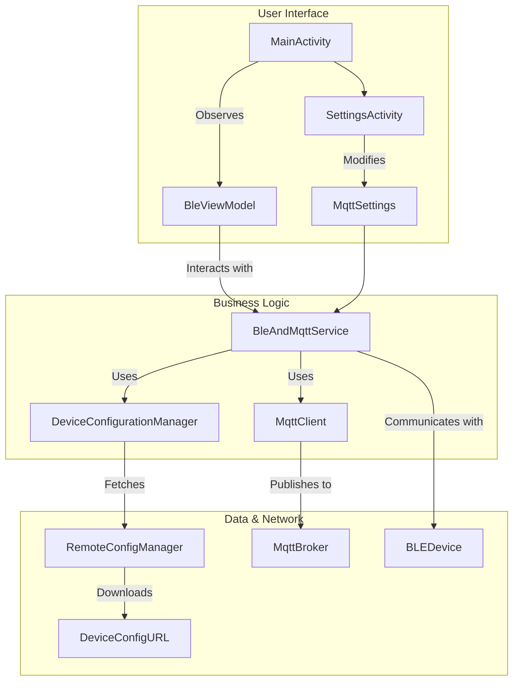

# BleIot - BLE to MQTT Bridge for Android

BleIot is an Android application designed to bridge the gap between Bluetooth Low Energy (BLE) devices and MQTT brokers. It allows for flexible, runtime configuration to scan, connect, and interact with various BLE devices, read their data, and forward it to a specified MQTT topic. The application has specialized support for Movesense sensors.

## Table of Contents

- [Key Features](#key-features)
- [Architecture Overview](#architecture-overview)
- [Project Structure](#project-structure)
- [Tech Stack & Libraries](#tech-stack--libraries)
- [Dependencies](#dependencies)
- [Setup and Configuration](#setup-and-configuration)
- [Building and Running](#building-and-running)
- [Usage](#usage)
- [Debugging](#debugging)

## Key Features

- **BLE Device Management**: Scan for nearby BLE devices and manage connections.
- **Dynamic Configuration**: Define device services, characteristics, and data parsing rules on the fly using a remote YAML configuration file.
- **MQTT Integration**: Publish data from BLE devices to a configurable MQTT broker.
- **Foreground Service**: Ensures continuous operation and data collection even when the app is in the background.
- **Movesense Support**: Specialized integration for Movesense devices, supporting both the standard GATT services and the "Whiteboard" high-speed data streaming API.
- **Modern UI**: Built with Jetpack Compose for a clean and responsive user interface.
- **Persistent Settings**: MQTT broker and configuration URL settings are saved locally on the device using DataStore Preferences.

## Architecture Overview

The application is built around a few core components:

- **`BleAndMqttService`**: A foreground `Service` that is the heart of the application. It manages all active BLE connections, handles service discovery, subscribes to characteristics, and manages the MQTT client connection and data publishing.
- **`BleViewModel`**: A `ViewModel` that provides the UI state. It communicates with the `BleAndMqttService` to start scans, initiate connections, and receive updates (like device status, received data, and RSSI). It exposes this data to the UI using `StateFlow`.
- **`SettingsActivity` & `MqttSettings`**: A settings screen allows the user to configure the MQTT broker details and the URL for the device configuration file. These settings are persisted locally using Jetpack DataStore.
- **`DeviceConfigurationManager` & `RemoteConfigManager`**: These classes handle the fetching, parsing, and storing of the device configuration YAML file. This allows for adding or modifying device profiles without needing to update the application code.



## Project Structure

```
.
├── app/                      # Main application module
│   ├── build.gradle.kts      # App-level Gradle build script
│   ├── src/
│   │   ├── main/
│   │   │   ├── java/it/unisalento/bleiot/
│   │   │   │   ├── BleAndMqttService.kt     # Core background service
│   │   │   │   ├── BleViewModel.kt          # ViewModel for the UI
│   │   │   │   ├── MainActivity.kt          # Main entry point of the app
│   │   │   │   ├── SettingsActivity.kt      # Settings screen
│   │   │   │   ├── DeviceConfiguration.kt   # Models for YAML config
│   │   │   │   └── RemoteConfigManager.kt   # Fetches remote config
│   │   │   └── AndroidManifest.xml
│   │   └── test/
├── build.gradle.kts          # Top-level Gradle build script
├── gradle.properties         # Project-wide Gradle settings
├── mds_lib/                    # Local directory for Movesense library
│   └── mdslib-*.aar            # Movesense library binary
└── sample_device_config.yaml # Example device configuration
```

## Tech Stack & Libraries

- **Language**: [Kotlin](https://kotlinlang.org/)
- **UI**: [Jetpack Compose](https://developer.android.com/jetpack/compose)
- **Asynchronicity**: Kotlin Coroutines & Flow
- **BLE Communication**: Android's native BLE APIs
- **Movesense Integration**: Movesense MDS Library (`mdslib-*.aar`)
- **MQTT Communication**: [Eclipse Paho MQTT Client](https://www.eclipse.org/paho/index.php?page=clients/java/index.php)
- **Configuration**:
  - [SnakeYAML](https://bitbucket.org/snakeyaml/snakeyaml/src/master/) for parsing device profiles.
  - [OkHttp](https://square.github.io/okhttp/) for fetching remote configurations.
- **Local Storage**: [Jetpack DataStore Preferences](https://developer.android.com/topic/libraries/architecture/datastore)

## Dependencies

This project uses Gradle for dependency management. Most dependencies are fetched from remote repositories like Maven Central.

### Local Dependencies

The **Movesense `mdslib-*.aar`** is included as a local binary in the `mds_lib/` directory. It is referenced in `app/build.gradle.kts` like this:

```kotlin
implementation(dependencyNotation = files("../mds_lib/mdslib-3.33.1-release.aar"))
```

If you need to update the Movesense library, replace the `.aar` file in the `mds_lib/` directory and update the file path in `app/build.gradle.kts`.

## Setup and Configuration

1.  **Clone the Repository**:
    ```bash
    git clone <repository-url>
    ```
2.  **Open in Android Studio**: Open the project in a recent version of Android Studio.

### Configuration

The application requires two main pieces of configuration, which are set within the app itself via the **Settings** menu.

#### 1. Device Configuration (YAML)

The app defines which devices to interact with and how to parse their data using a YAML file. A `sample_device_config.yaml` is included in the repository to serve as a template.

- **Host your own `device_config.yaml`**: You must host a YAML file (based on the sample) at a publicly accessible URL.
- **Set the URL in the app**:
  1.  Navigate to the **Settings** screen in the app.
  2.  Enter the URL to your YAML file in the "Config URL" field.
  3.  Press **"Save URL"** to store it.
  4.  Press **"Refresh"** to download and apply the aconfiguration.

**YAML Configuration Format:**

The YAML file has a `devices` key, which contains a list of device profiles. Each profile has a name and a list of services and characteristics.

```yaml
devices:
  MyDevice:
    name: "MyDevice"
    shortName: "MyDevice"
    services:
      - uuid: "0000180f-0000-1000-8000-00805f9b34fb"
        name: "Battery Service"
        characteristics:
          - uuid: "00002a19-0000-1000-8000-00805f9b34fb"
            name: "Battery Level"
            dataType: "ble_battery_level"
            mqttTopic: "ble/battery"
```

For more complex parsing, you can use `structParser`:
```yaml
          - uuid: "00140000-0001-11e1-ac36-0002a5d5c51b"
            name: "BLUENRG_MS_TEMPERATURE_CHARACTERISTIC"
            dataType: "custom_temperature"
            mqttTopic: "ble/dummylp/temperature"
            structParser:
              endianness: "LITTLE_ENDIAN"
              fields:
                - name: "stimestamp"
                  type: "ushort"
                - name: "pressure"
                  type: "int"
                - name: "temperature"
                  type: "short"
```

#### 2. MQTT Broker

1.  Navigate to the **Settings** screen.
2.  Enter your MQTT broker's server address, port, and credentials (if any).
3.  Press **"Save MQTT Settings"**. The service will attempt to reconnect with the new settings.

## Building and Running

This is a standard Android project. You can build and run it from Android Studio or using Gradle from the command line.

**From Android Studio:**

1.  Open the project in Android Studio.
2.  Select the `app` run configuration.
3.  Choose a target device (emulator or physical device).
4.  Click the "Run" button.

**From the command line:**

To build the debug APK:
```bash
./gradlew assembleDebug
```

To install the debug APK on a connected device:
```bash
./gradlew installDebug
```

To run tests:
```bash
./gradlew connectedAndroidTest
```

*Note: You might need to configure the `org.gradle.java.home` property in `gradle.properties` if your JDK is not in a standard location.*

## Usage

1.  **Launch the App**: Start the application on an Android device.
2.  **Configure**: Complete the setup steps outlined above to configure the MQTT broker and the device configuration URL.
3.  **Start Scan**: From the main screen, tap the "Start Scan" button. The app will begin scanning for nearby BLE devices.
4.  **Connect to Device**: Discovered devices will appear in a list. Tap on a device to initiate a connection.
5.  **Data Forwarding**: Once a device is connected, the `BleAndMqttService` will:
    - Discover its services and characteristics.
    - Match them against the profiles in your YAML configuration.
    - Automatically subscribe to notifications/indications for specified characteristics.
    - Begin publishing received data to the corresponding MQTT topics defined in your configuration.
    - For Movesense devices, it will also handle "Whiteboard" subscriptions.

## Debugging

The original `Readme.md` contained instructions for using `adb`. To see logs from the application, you can use `logcat` in Android Studio or the command line:

```shell
# Start the adb server
adb start-server

# List connected devices
adb devices

# View logs from the app, filtering by the app's tag
adb logcat -s "BleViewModel" "BleAndMqttService" "RemoteConfigManager" "DeviceConfiguration"
```